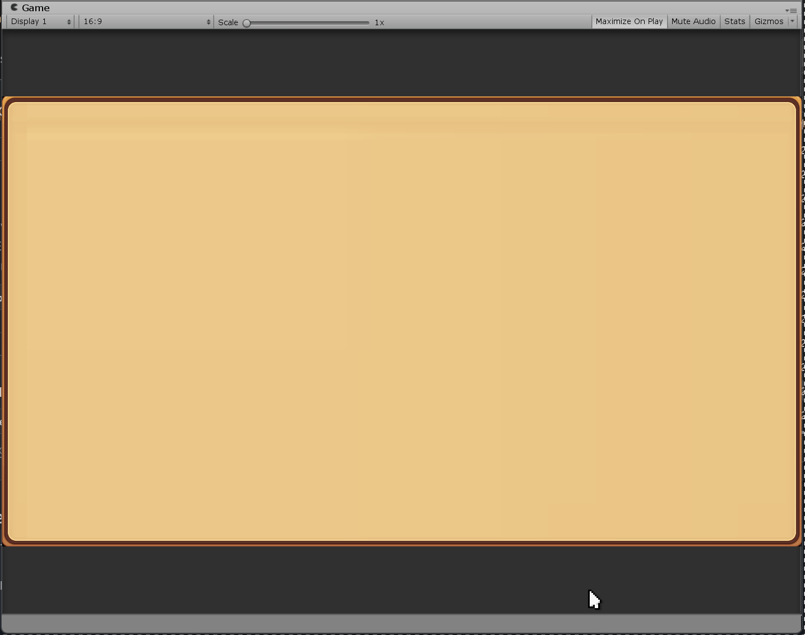

# ShapeWipe



**Unity 屏幕转场遮罩工具，灵感来自《蔚蓝》(Celeste)。**  
**Unity screen transition mask tool inspired by Celeste.**

[](https://opensource.org/licenses/MIT)
[](https://unity.com/)
[](https://github.com/woodie239699/UnityShapeWipe)
[](https://gitee.com/nowerebeaver/UnityShapeWipe/stargazers)

[简体中文](#简体中文) | [English](#english)

---

## 简体中文

### 简介

ShapeWipe 是一套受《蔚蓝》(Celeste) 启发的 Unity 屏幕转场遮罩工具。基于 Built-in 渲染管线，通过一个全屏 Quad 和自定义 Shader 实现多形状、两阶段的擦除转场效果。

- **最多 200 个 shape 实例**，每像素循环合并，`_ActiveCount` 控制提前退出
- **两阶段转场**：Close（涂黑）+ Open（擦除），支持 `reverseClosePhase` / `reverseOpenPhase`
- **每个 shape 独立控制**：位置、起止缩放、起止旋转、延迟、展开时长、wipeOffset
- **FlipMode**：None / Horizontal / Vertical / Both，利用 `gridPos` 镜像 delay 顺序
- **网格生成器**：6 种 DelayOrder，支持 Margin / Stagger / Snake / Post Offset
- **运行时随机化**：位置、旋转、延迟、End Scale，可每阶段重新随机
- **自定义 Inspector**：折叠区、16:9 位置预览、进度预览、自动播放
- **支持外部加载协程**：`Play(Func<IEnumerator>)` 替代固定 holdDuration
- **可选 UI RectTransform 缩放同步**
- **C# 端预计算 sin/cos**，Shader 只做 lerp，省掉每像素三角函数开销

### 环境要求

| 项目 | 要求 |
|------|------|
| Unity 版本 | 2018.4+ |
| 渲染管线 | Built-in |
| 移动端 | GLES 2.0 不支持动态循环，需降低 `MAX_SHAPES` |

### 安装

**通过 Git URL 安装（推荐）**

**GitHub：**

1. 打开 Unity → Window → Package Manager
2. 点击 `+` → Add package from git URL
3. 粘贴：`https://github.com/woodie239699/UnityShapeWipe.git`

**Gitee（国内推荐）：**

1. 打开 Unity → Window → Package Manager
2. 点击 `+` → Add package from git URL
3. 粘贴：`https://gitee.com/nowerebeaver/UnityShapeWipe.git`

### 快速开始

1. 创建材质，Shader 选择 `ShapeWipe/Mask`
2. 在 Canvas 下创建全屏 Image / RawImage 或 Quad，赋值该材质
3. 添加 `ShapeWipe` 组件，指定 `maskMaterial`
4. 调整 `shapes`，或使用 Grid Generator 批量生成
5. 运行后按 测试按键 触发转场，或调用 `Play()`

### 代码调用

```csharp
// 简单调用
ShapeWipe wipe = GetComponent<ShapeWipe>();
StartCoroutine(wipe.Play());

// 带加载协程（传入自定义的 IEnumerator）
StartCoroutine(wipe.Play(() => {
    // 这里返回你自己的协程方法
    return LoadSceneAsync("Level2");
}));
```

### 网格生成器使用说明

修改 Grid Generator 参数后，**必须点击 Replace All 或 Append** 才会生效。生成时自动填入 `gridPos`，供 FlipMode 使用。

### 许可证

MIT

---

## English

### Introduction

ShapeWipe is a Unity screen transition mask tool inspired by Celeste's Wipe effect. Built on the Built-in render pipeline, it uses a fullscreen quad and a custom shader to achieve multi-shape, two-phase wipe transitions.

- **Up to 200 shape instances** merged per-pixel with `max()`, early exit via `_ActiveCount`
- **Two-phase transition**: Close (black) + Open (erase), with `reverseClosePhase` / `reverseOpenPhase`
- **Per-shape control**: position, start/end scale, start/end rotation, delay, expand duration, wipeOffset
- **FlipMode**: None / Horizontal / Vertical / Both, mirrors delay ramp spatially via `gridPos`
- **Grid Generator**: 6 DelayOrder modes, supports Margin / Stagger / Snake / Post Offset
- **Runtime randomization**: position, rotation, delay, end scale, optional per-phase re-roll
- **Custom Inspector**: foldouts, 16:9 position preview, progress preview, auto-play
- **External load coroutine support**: `Play(Func<IEnumerator>)` replaces fixed holdDuration
- **Optional UI RectTransform scale sync**
- **Precomputed sin/cos on C# side**, shader only lerps — saves per-pixel trig

### Requirements

| Item | Requirement |
|------|-------------|
| Unity Version | 2018.4+ |
| Render Pipeline | Built-in |
| Mobile | GLES 2.0 fails to compile due to dynamic loop; reduce `MAX_SHAPES` |

### Installation

**Via Git URL (Recommended)**

**GitHub:**

1. Open Unity → Window → Package Manager
2. Click `+` → Add package from git URL
3. Paste: `https://github.com/woodie239699/UnityShapeWipe.git`

**Gitee (Recommended for China):**

1. Open Unity → Window → Package Manager
2. Click `+` → Add package from git URL
3. Paste: `https://gitee.com/nowerebeaver/UnityShapeWipe.git`

### Quick Start

1. Create a material with shader `ShapeWipe/Mask`
2. Create a fullscreen Image / RawImage or Quad under Canvas, assign the material
3. Add the `ShapeWipe` component, assign `maskMaterial`
4. Adjust `shapes`, or use Grid Generator to batch-generate
5. Press Test Key to trigger, or call `Play()`

### Code Usage

```csharp
// Simple call
ShapeWipe wipe = GetComponent<ShapeWipe>();
StartCoroutine(wipe.Play());

// With load coroutine (pass in a custom IEnumerator)
StartCoroutine(wipe.Play(() => {
    // Return your custom coroutine here
    return LoadSceneAsync("Level2");
}));
```

### Grid Generator Notes

After changing Grid Generator parameters, you **must click Replace All or Append** for changes to take effect. `gridPos` is auto-filled for FlipMode.

### License

MIT

---

## Links

- GitHub: https://github.com/woodie239699/UnityShapeWipe
- Gitee: https://gitee.com/nowerebeaver/UnityShapeWipe